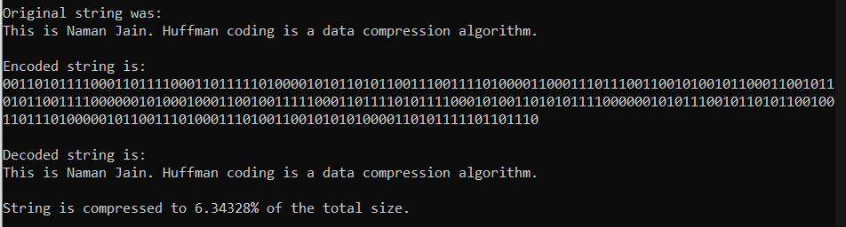

# Huffman Coding
A C++ compression and decompression program based on Huffman Coding.

## Introduction

This project is to design compression and decompression programs based on Huffman Coding.
The idea of Huffman Coding is to minimize the weighted expected length of the code by means of assigning shorter codes to frequently-used characters and longer codes to seldom-used code.

## Implementation Details

The programs can compress and decompress text file consisting of 128 ASCII characters.

### Compression

1. Open input file, count and store the frequencies of different characters;
2. Construct Priority Queue and then Huffman Tree;
3. Calculate Huffman Encode Table;
4. Encode the file, store Huffman Encode Table and encoded to the desired file.

### Decompression

1. Open file, recreate Huffman Tree based on Huffman Encode Table;
2. Decode the file based on the tree and store it to the desired file.

***The algorithm serializes the encoded text as a binary/decimal sequence and the corresponding Huffman binary tree in order to be able to decode back the text in the future.***

Here is an example:
Huffman codes for each character in the given text:

Text encoded in a binary format, decoded text and compression ratio:

As can be seen, string is compressed to about 6% of the original string which was given as input.
